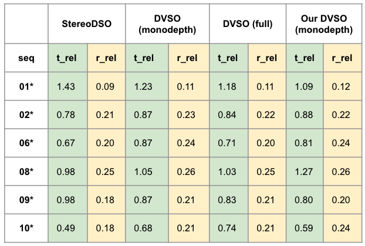
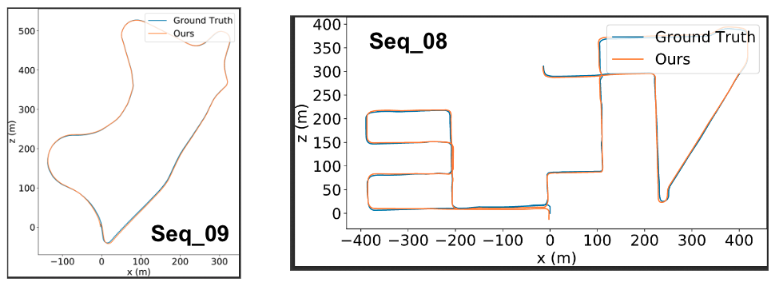
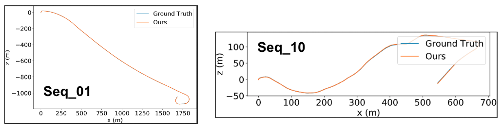
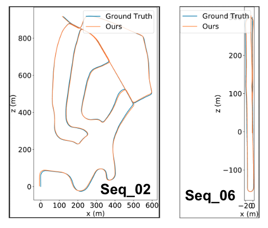

------
# DVSO: Deep Virtual Stereo Odometry 

This is an unofficial C++ implementation of the **ECCV 2018** paper: **Deep virtual stereo odometry: Leveraging deep depth prediction for monocular direct sparse odometry** (DVSO). This implementation is intended for the use of the virtual stereo optimization in our **ICRA 2022** paper: **Towards Scale Consistent Monocular Visual Odometry by Learning from the Virtual World**. 

If you find this project useful in your research, please consider citing the following papers:
```
@article{engel2017direct,
  title={Direct sparse odometry},
  author={Engel, Jakob and Koltun, Vladlen and Cremers, Daniel},
  journal={IEEE transactions on pattern analysis and machine intelligence},
  volume={40},
  number={3},
  pages={611--625},
  year={2017},
  publisher={IEEE}
}

@inproceedings{yang2018deep,
  title={Deep virtual stereo odometry: Leveraging deep depth prediction for monocular direct sparse odometry},
  author={Yang, Nan and Wang, Rui and Stuckler, Jorg and Cremers, Daniel},
  booktitle={Proceedings of the European Conference on Computer Vision (ECCV)},
  pages={817--833},
  year={2018}
}

@article{zhang2022towards,
  title={Towards Scale Consistent Monocular Visual Odometry by Learning from the Virtual World},
  author={Zhang, Sen and Zhang, Jing and Tao, Dacheng},
  journal={arXiv preprint arXiv:2203.05712},
  year={2022}
}
```


This project is built upon the [DSO](https://github.com/JakobEngel/dso) codebase. The borrowed codes are licensed under the original license of DSO. Special thanks to this great work by J. Engel, V. Koltun, and D. Cremers. For more information, see
[https://vision.in.tum.de/dso](https://vision.in.tum.de/dso).

---
## Installation

* Please follow the instructions in [DSO](https://github.com/JakobEngel/dso) to install necessary packages
    * **Important change for Pangolin installation**
        * The most recent version of Pangolin is not compatible anymore!!!
        * Please use the older version of Pangolin: 
            ```
            git reset --hard 86eb4975fc
            ```
* Build 
    ```
    cd dvso
    mkdir build
    cd build
    cmake ..
    make -j4
    ```

------
## Usage
You can run DVSO using the command:
```
bin/dvso_dataset \
			files=XXXXX/seq_XX/images \
            calib=XXXXX/seq_XX/camera.txt \
            disps_left=XXXXX/seq_XX/disparities_pp_left.npy \
            disps_right=XXXXX/seq_XX/disparities_pp_right.npy \
            mode=1
```
Please refer to [DSO](https://github.com/JakobEngel/dso) for the usage of ```mode```, ```files```, and ```calib```.

* ```disps_left```: path to the npy file of the disparities of the left images. The left disparities are used for depth initialization.
* ```disps_right```: path to the npy file of the disparities of the right images. The right disparities are used for the virtual stereo optimization.


**Commandline Options**

We follow the routine of [DSO](https://github.com/JakobEngel/dso), thus the options in [DSO](https://github.com/JakobEngel/dso) can still be used here. The options related to the virtual stereo functionality are listed below:

You may need to modify ```wStereo```, ```scaleEnergyLeftTHR```, and ```scaleWJI2SumTHR ``` on your own dataset:
* ```wStereo=1``` (by default): the weight for the virtual stereo residue

* ```scaleEnergyLeftTHR=2``` (by default): a threshold used for determining the outlier status. The smaller this value is, the more outliers are allowed. 

* ```scaleWJI2SumTHR=2``` (by default): a threshold used for determining the outlier status. The larger this value is, the more outliers are allowed. 

The following options are used primarily for debugging and developing. We suggest keep the defaults values:

* ```judgeHW=1``` (by default): only take the square root of the huber energy if its value is smaller than 1. You can disable this functionality by setting ```judgeHW=0```

* ```maskWarpGrad=1``` (by default): set the gradient of warped holes to be 0. You can disable this functionality by setting ```maskWarpGrad=0```

* ```checkWarpValid=1``` (by default): check whether a point warping is valid or not before adding the virtual stereo residue. You can disable this functionality by setting ```checkWarpValid=0```

* ```useVS=1``` (by default): use the virtual stereo residue. You can disable this functionality by setting ```useVS=0```

* ```wStereoPosFlag=Before``` (by default): where to multiply wStereo to the huber energy, before we take the square root of the huber energy or after. You can optionally use ```wStereoPosFlag=After```

* ```wCorrectedFlag=Ori``` (by default): use the original huber loss implementation in DSO, which is a little bit different from the definition of huber. You can optionally use ```wCorrectedFlag=Corr``` to try the implementation based on the definition of huber. 

* ```wGradFlag=Hit``` (by default): use the original implementation of pixel weighting in DSO. You can optionally use ```wGradFlag=Grad``` to update the image gradients used in pixel weighting to the counterparts that further incorporate the disparity map gradients


------
## Auxiliary scripts
* **format_kitti.py**: used for transforming DVSO / DSO results (with ids rather than timestamps) to the KITTI format for evaluation
    * You may need to rename the DSO result file to result_seq_suf.txt before running this script, e.g., ```mv result.txt result_$seq.$suf.txt```
    * You may need to change some absolute path inside this script to your own path
    * This script will generate reformated results that are compatible with [evo](https://github.com/MichaelGrupp/evo) and [Zhan](https://github.com/Huangying-Zhan/kitti-odom-eval)'s evaluation code. Please follow their instructions on evaluating the results.
        * For [evo](https://github.com/MichaelGrupp/evo), the reformated results are saved in ```aligned_seq_suf/```. Note in this case no ids are remained, but each line of dso and kitti results are matched
        * For [Zhan](https://github.com/Huangying-Zhan/kitti-odom-eval)'s evaluation code, the reformated results are saved in ```zhan_seq_suf/seq.txt```


------
## Reproduced results

We do not re-implement the depth networks proposed in the original DVSO paper. Instead, we just use the disparities predicted by [monodepth](https://github.com/mrharicot/monodepth), which can already achieve quite satisfactory results:







